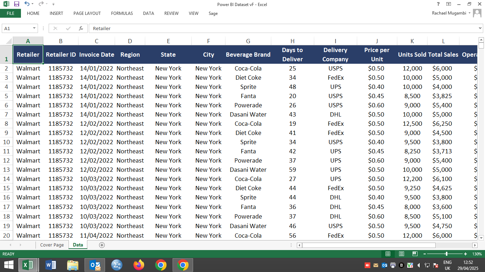
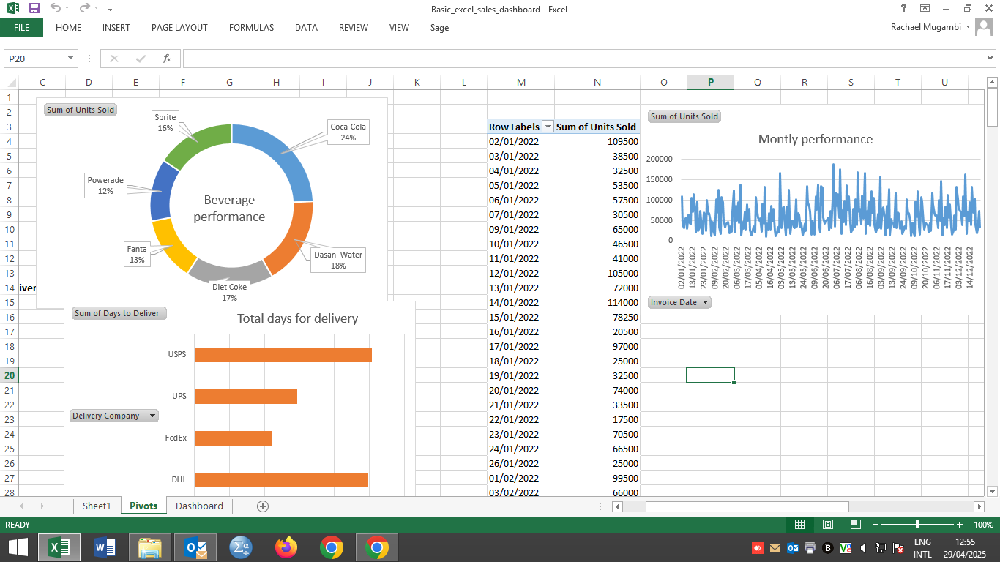

# FMCG_sales_dashboard_excel
FMCG Sales Dashboard - Excel edition
 
When I received the raw data, I had to go through it to see whether there are any dupliocates or any outliers.
After cleaning I added the column on total cost because that was one of the KPIs which can be obtained by subtracting total profit from total revenue.
I then added a sheet to do the rough draft and pivot tables.
! [Pivot excel sheet](Pivot.png) 
I then mapped out how I would like the dashboard to look like including slicers and a timeline.
I ensured that they apply to all the pivot tables then arranged them in an aesthetically pleasing way to give the final dashboard.

